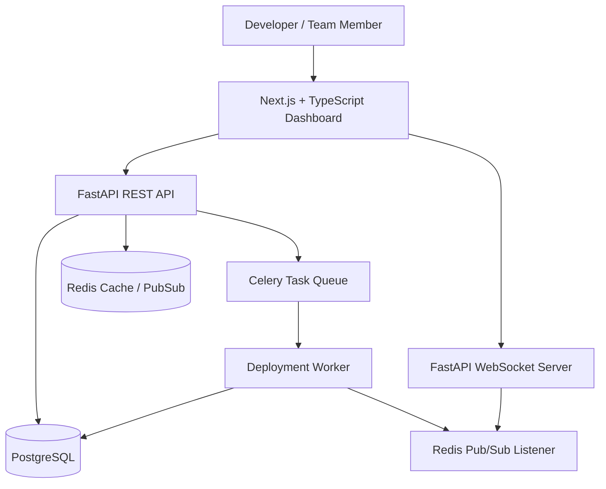

# CloudCollab

**Distributed Real-Time Collaborative Cloud Deployment Platform**

A full-stack platform where teams manage projects, edit infrastructure files together in real time, trigger deployment simulations, stream live logs, and monitor system activity from one dashboard.

---

## Problem Statement

Cloud infrastructure work is usually split across too many tools — code editors, deployment pipelines, chat, dashboards, logs, and incident notes. That fragmentation slows teams down, makes collaboration harder, and creates unclear ownership during deploys and incidents. CloudCollab brings those workflows into one shared workspace.

---

## Core Features

- Team workspaces and projects
- Real-time collaborative editing for infrastructure and config files
- Deployment job triggering and status tracking
- Live log streaming and deployment observability
- Metrics and audit history views
- Authentication and access control foundation

---

## Tech Stack

| Layer | Technology |
|---|---|
| Frontend | TypeScript, React/Next.js, Tailwind CSS, shadcn/ui |
| Editor | Monaco Editor |
| Collaboration | Yjs |
| Backend | FastAPI |
| Realtime | FastAPI WebSockets |
| Database | PostgreSQL |
| Cache / PubSub / Broker | Redis |
| Background Jobs | Celery + Redis |
| Runtime / Infra | Docker + Docker Compose |
| Auth | JWT |
| CI/CD | GitHub Actions |

---

## High-Level Architecture

- Frontend provides the dashboard, editor, logs, and metrics UI.
- FastAPI serves REST APIs, auth, and realtime endpoints.
- PostgreSQL stores users, workspaces, projects, and history.
- Redis supports pub/sub, caching, and Celery job coordination.
- Celery workers simulate and later execute deployment workflows.
- Docker Compose provides local infrastructure dependencies.



---

## Local Development

```bash
cd backend
pip install -r requirements.txt
uvicorn app.main:app --reload --port 8000

cd ../infra
docker compose up -d postgres redis
```

---

## Project Status

**Foundation setup.** The repository currently contains the initial monorepo structure, documentation, and minimal backend and infrastructure stubs only. Core features listed above are planned/in-progress, not yet fully implemented.

---

## Folder Structure
