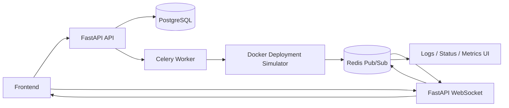

# Architecture

CloudCollab is organized as a set of focused services around a shared collaboration and deployment workflow.

## Reading The Diagram

- The frontend talks to the FastAPI API for normal application requests.
- The API persists project and workspace data in PostgreSQL.
- The frontend connects to FastAPI WebSockets for collaboration and live updates.
- Redis acts as the pub/sub layer that moves realtime events between the backend and UI.
- FastAPI sends deployment work to Celery workers.
- The worker runs a Docker-based deployment simulator in this prototype phase.
- Status and log events are published back through Redis and WebSockets so the frontend can show them live.
